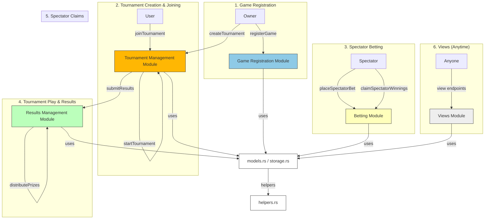

# Tournament Hub Smart Contract

This project implements a modular smart contract for managing tournaments, games, and spectator betting on the MultiversX blockchain. The contract is designed for clarity, maintainability, and extensibility, with logic split into focused modules.

## Project Structure

```
contracts/tournament-hub/
├── src/
│   ├── helpers.rs              # Private helper functions used across modules
│   ├── models.rs               # Data structures and enums (GameConfig, Tournament, etc.)
│   ├── storage.rs              # Storage mappers for contract state
│   ├── views.rs                # View (query) endpoints
│   ├── tournament_hub.rs       # Main contract trait, only init/upgrade logic and trait composition
│   └── tournament_logic/
│       ├── game_registration.rs      # Game registration endpoints
│       ├── tournament_management.rs # Tournament creation, joining, starting
│       ├── results_management.rs    # Result submission and prize distribution
│       └── spectator_betting.rs     # Spectator betting and claims
└── README.md
```

## Module Overview

- **models.rs**: Contains all core data structures and enums, such as `GameConfig`, `Tournament`, `TournamentStatus`, etc.
- **storage.rs**: Defines storage mappers for persistent contract state (games, tournaments, bets, etc.).
- **helpers.rs**: Private helper functions for internal contract logic (e.g., signature verification, prize distribution).
- **views.rs**: Read-only endpoints for querying contract state (game config, tournament info, bets, etc.).
- **tournament_logic/**: Contains logic modules for each major contract feature:
  - **game_registration.rs**: Endpoints for registering new games (owner only).
  - **tournament_management.rs**: Endpoints for creating, joining, and starting tournaments.
  - **results_management.rs**: Endpoints for submitting results and distributing prizes.
  - **spectator_betting.rs**: Endpoints for placing bets and claiming winnings as a spectator.
- **tournament_hub.rs**: The main contract file. It only contains the contract trait, which composes all modules, and the `init`/`upgrade` functions.

## Key Features

- **Modular Design**: Each logical area is in its own file, making the codebase easy to navigate and extend.
- **Owner-Only Game Registration**: Only the contract owner can register new games.
- **Tournament Lifecycle**: Create, join, and start tournaments, with deadlines and entry fees.
- **Result Submission**: Secure result submission and prize distribution, including house fees and podium splits.
- **Spectator Betting**: Spectators can bet on players, with winnings distributed based on final results.
- **View Endpoints**: Query all relevant contract state for games, tournaments, and bets.

## How to Extend

- Add new features by creating new modules in `tournament_logic/` or extending existing ones.
- Add new data structures to `models.rs` and new storage mappers to `storage.rs` as needed.
- Keep the main contract file (`tournament_hub.rs`) minimal—only trait composition and lifecycle functions.

---

For more details on each module, see the comments at the top of each file. 

## Flow diagram

